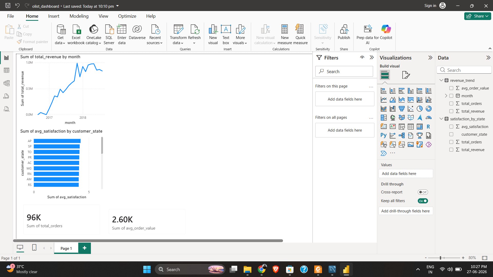

# E-Commerce Seller Operations Analysis

## Problem Statement
Customer dissatisfaction directly impacts retention and revenue in e-commerce platforms. 
This project identifies what drives dissatisfaction, which sellers are underperforming, 
and builds a predictive model to flag at-risk orders.

## Tools Used
- Python (pandas, scikit-learn)
- MySQL — data extraction and joins across 5 tables
- Power BI — interactive dashboard

## Dashboard Preview

## Dataset
- Source: Olist Brazilian E-Commerce (Kaggle)
- Size: 110,000+ orders across 5 related tables
- Domain: Orders, sellers, products, reviews, logistics

## Key Findings
- Late deliveries drive **7x higher dissatisfaction** (79.7%) vs early deliveries (11.3%)
- Just **16 sellers (1.2%)** show 59.6% dissatisfaction — 6.2x worse than high performers
- **Price has near-zero impact** on dissatisfaction — delivery is the primary lever
- Office furniture (25.4%) and audio (21.7%) are highest risk physical categories

## What I Built
- Delivery timing analysis across 110k orders
- Composite seller health scoring system (weighted KPI model)
- Binary dissatisfaction classifier — Random Forest vs Logistic Regression
- Business recommendations with expected impact

## Model Performance
| Model | AUC-ROC |
|---|---|
| Logistic Regression | 0.652 |
| Random Forest | 0.801 |

Top predictor: delivery_delay_days

## Project Structure
- `olist_analysis.sql` — MySQL queries for seller performance, late delivery risk, revenue trends
- `olist_ecommerce_analysis.ipynb` — Full analysis notebook
- `eda_overview.png` — EDA visualizations
- `seller_health.png` — Seller segmentation charts
- `feature_importance.png` — Model feature importance

## How To Run
1. Download Olist dataset from Kaggle
2. Upload CSV files to Google Colab
3. Run all cells in `olist_ecommerce_analysis.ipynb`
